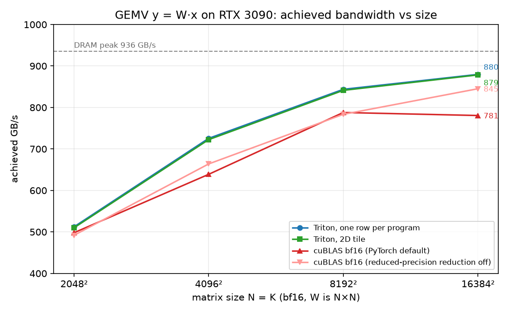

# Triton GEMV vs the roofline

> The kernels, the runs and the logs are mine. The plot script and this README were written with
> Claude Code; I checked every number here against the logs.

Three Triton GEMV kernels (`y = W·x`, bf16, batch size 1), measured against cuBLAS on an RTX 3090
from 2048² to 16384². The naive kernel was already at the card's ceiling. The 20% I was missing at
4096² was a fixed cost per launch, not the kernel.



| N = K | cuBLAS (PyTorch default) | cuBLAS (reduced-precision off) | one row per program | 8-row strip | 2D tile |
|---|---|---|---|---|---|
| 2048² | 498 | 492 | **518** | 499 | 510 |
| 4096² | 639 | 664 | **728** | 725 | 723 |
| 8192² | 788 | 783 | **843** | 764 | 841 |
| 16384² | 781 | 845 | **879** | 846 | 878 |

GB/s, best config per kernel. The card's spec-sheet peak is 936 GB/s. Numbers come from `table.log`
and `table-default-flag.log`.

## What I found

- **Restructuring the kernel changed nothing.** One row per program, 8 rows per program, and a 2D
  tile all land within 1% of each other at every size. The strip version is actually 4–8% slower
  at 8192² and up: rows done one after another inside a program keep fewer bytes in flight.
- **Two numbers explain the whole sweep.** Time ≈ 7 µs + bytes / 880 GB/s. The kernel always moved
  data at about 880 GB/s, which is the real ceiling of this card (94% of 936). The 7 µs is launch
  plus ramp-up plus the tail. It's 15% of a 46 µs run and 1% of a 610 µs run. Nothing got faster
  with size, the fixed part just got amortised.
- **PyTorch's default bf16 GEMV is not exact at K ≥ 8192.** With
  `torch.backends.cuda.matmul.allow_bf16_reduced_precision_reduction` left at `True`, cuBLAS
  returned 0.03 for an element whose fp32 value is −0.14. My kernels keep the sum in fp32 and match
  the fp32 reference. With the flag off, cuBLAS agrees, and at 16384² it's also faster (845 vs 781).

Why this matters: a decode step is one GEMV per layer, at the small end of this curve, so it pays
that fixed cost a few hundred times per token. That's the reason CUDA graphs, kernel fusion and
persistent kernels exist.

Write-up: <notion link>

## Files

- `gemv_triton.py` — the three kernels and the sweep (prints the tables).
- `plot_sweep.py` — draws `gemv_sweep.png` from the two logs. No GPU needed.
- `table.log` — the final sweep, reduced-precision reduction off.
- `table-default-flag.log` — the same sweep with PyTorch's default, where `all_close` fails at
  K ≥ 8192.

## Run

```
pip install torch triton
python gemv_triton.py 2>&1 | tee table.log
python plot_sweep.py
```

RTX 3090 on Vast.ai, torch 2.11 + cu128, triton 3.6, bf16.
